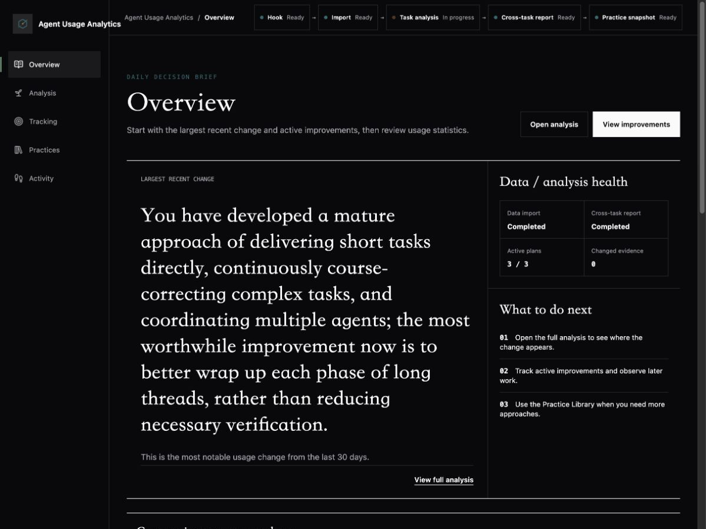
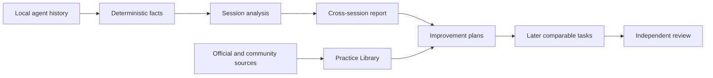

<div align="center">
  
  <h1>Agent Usage Analyzer</h1>
  <p><strong>Turn local coding-agent history into evidence-backed insights and measurable improvement plans.</strong></p>
  <p>
    <a href="./README.md">English</a> ·
    <a href="./README.zh-CN.md">简体中文</a>
  </p>
  <p>
    <a href="https://www.npmjs.com/package/agent-usage-analyze"></a>
    <a href="./LICENSE"></a>
    
    
  </p>
</div>

<p align="center">
  
</p>

Agent Usage Analyzer is a local-first review workspace for people who build with coding agents. It combines deterministic usage data with LLM analysis to explain how you work, surface recurring strengths and friction, compare current practice with public evidence, and observe whether an improvement actually changes later tasks.

Codex has the most complete capture and analysis path. Local history from Claude Code, Cursor, GitHub Copilot CLI, and GitHub Copilot can also be imported.

## Why use it?

- **See the whole workflow** — sessions, root tasks, sub-agents, tools, Skills, Token composition, duration, and prompt quality.
- **Understand recurring behavior** — evidence-linked analysis across representative sessions instead of a single score.
- **Turn advice into observation** — track a small set of improvement plans against later, comparable tasks.
- **Stay current** — browse official guidance and well-supported community practice with source, recency, discussion, and local relevance kept separate.
- **Keep control of the data** — the dashboard and database stay on your machine; the service listens on `127.0.0.1`.
- **Use it in English or Chinese** — the interface follows the browser language on first launch and remembers your choice.

## Quick start

Requirements: Node.js 18 or newer.

```sh
npx --yes agent-usage-analyze start
```

The first run initializes local storage, imports supported history, configures Codex capture, starts the loopback dashboard, and registers the local service to start when you sign in on macOS. Once setup completes, the command exits and the import continues in the background.

Open [http://localhost:7890](http://localhost:7890) if the dashboard does not open automatically.

> Codex may ask you to trust the installed handler in `/hooks` once. The first-run guide shows where to review it.

## Product tour

| Workspace | What it helps you do |
| --- | --- |
| **Overview** | See the most important recent change, active improvements, and usage trends. |
| **Analysis** | Review a 30-day cross-session report with evidence boundaries and representative sessions. |
| **Tracking** | Observe later tasks against LLM-defined conditions, guardrails, and review criteria. |
| **Practices** | Explore current official and community-supported approaches by source quality and relevance. |
| **Activity** | Browse sessions chronologically and open the evidence workspace only when needed. |
| **Settings** | Check capture/import/analysis health, model usage, language, automation, and local runtime. |

### Evidence, interpretation, and follow-up



Local facts and model judgment remain distinct throughout the product. Counts come from imported events; explanations, dynamic analysis dimensions, practice synthesis, and review conditions come from the selected model.

## Automatic workflow

1. **Capture** — trusted Codex hooks and the local watcher detect stable session updates.
2. **Import** — supported histories are normalized into a local SQLite database.
3. **Session analysis** — eligible sessions receive summaries, decisions, reusable experience, Skill observations, and prompt-quality analysis.
4. **Cross-session report** — new evidence can refresh the rolling 30-day report.
5. **Practice and tracking** — public evidence can inform candidate approaches; later local tasks provide the observation record.

The top status bar shows where work is currently running and links to the relevant recovery action when attention is needed.

## Privacy

- The WebUI listens only on `127.0.0.1`.
- Sessions, queues, analysis results, and logs remain in the local data directory.
- Product telemetry is off by default.
- Cross-session analysis uses bounded, sanitized structured evidence.
- Public practice research receives abstract topics after a local privacy check, not raw prompts, code, logs, repository names, or local paths.
- Codex mode reuses the signed-in Codex capability. A custom model provider is optional.

See [UPSTREAM.md](./UPSTREAM.md) for third-party sources and local modification boundaries.

## Commands

```sh
# Start the service, update capture, import history, and open the WebUI
agent-usage-analyze start

# Keep the initial import attached to this terminal
agent-usage-analyze start --wait-for-import

# Check service, capture, data, and analysis capability
agent-usage-analyze status

# Diagnose the local installation
agent-usage-analyze doctor --verbose

# Start without opening a browser
agent-usage-analyze start --no-open

# Remove hooks, the background service, and all local product data
agent-usage-analyze uninstall
```

## Troubleshooting

If a new Codex session does not appear:

1. Check the pipeline status in **Settings**.
2. Open Codex `/hooks` and confirm the Agent Usage Analyzer handler is installed and trusted.
3. Run `agent-usage-analyze doctor --verbose`.
4. End one small test session and confirm that it appears in **Activity**.

## Development

```sh
pnpm install
pnpm test
pnpm build
```

The workspace contains three packages:

- `cli` — capture, import, analysis, scheduling, practice research, tracking, and lifecycle commands.
- `server` — the loopback API and session watcher.
- `dashboard` — the React WebUI.

Before a release:

```sh
pnpm test:release
pnpm release:check-publish
pnpm audit:v1
pnpm package:smoke
git diff --check
```

See [npm publishing](./docs/npm-publishing.md) for the release workflow.

## License

[MIT](./LICENSE)
