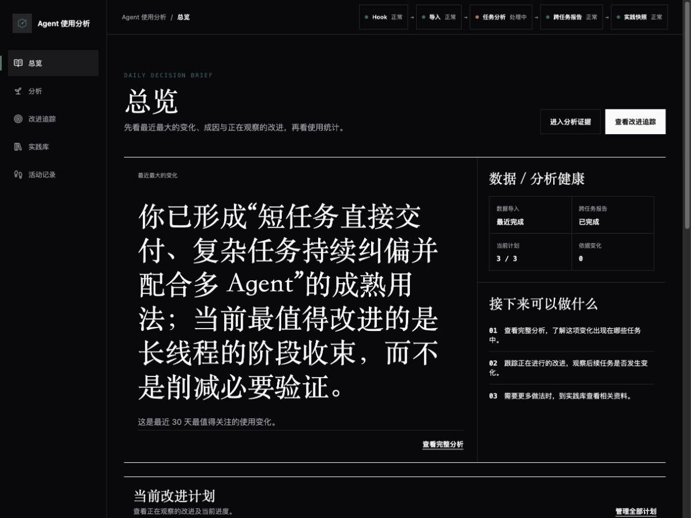
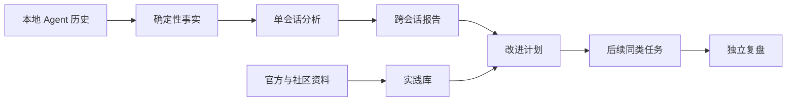

<div align="center">
  
  <h1>Agent 使用分析</h1>
  <p><strong>把本地编码 Agent 历史变成可核对的洞察和可持续追踪的改进计划。</strong></p>
  <p>
    <a href="./README.md">English</a> ·
    <a href="./README.zh-CN.md">简体中文</a>
  </p>
  <p>
    <a href="https://www.npmjs.com/package/agent-usage-analyze"></a>
    <a href="./LICENSE"></a>
    
    
  </p>
</div>

<p align="center">
  
</p>

Agent 使用分析是一套面向编码 Agent 使用者的本地优先复盘工作区。它把确定性使用数据与 LLM 分析结合起来，解释你的工作方式、发现反复出现的优势与阻力、对照当前公开实践，并持续观察改进是否真的影响后续任务。

当前对 Codex 的采集和分析支持最完整；同时可以导入 Claude Code、Cursor、GitHub Copilot CLI 和 GitHub Copilot 的本地历史。

## 为什么使用它

- **看清完整工作流**：会话、主任务、子 Agent、工具、Skill、Token 组成、持续时间和提示词质量。
- **理解重复行为**：基于代表性会话和证据链做跨会话分析，而不是只给出一个分数。
- **把建议变成观察**：针对后续同类任务追踪少量改进计划。
- **跟上当前实践**：分别查看官方资料和社区实践的来源质量、时效、讨论度与本地相关性。
- **掌控本地数据**：Dashboard 和数据库都保存在本机，服务只监听 `127.0.0.1`。
- **支持中英文**：首次启动跟随浏览器语言，之后记住你的选择。

## 快速开始

要求 Node.js 18 或更新版本。

```sh
npx --yes agent-usage-analyze start
```

首次运行会初始化本地存储、导入支持的历史、配置 Codex 采集、启动本地 Dashboard，并在 macOS 注册登录后自动启动的本地服务。安装完成后命令会退出，历史导入继续在后台运行。

如果页面没有自动打开，请访问 [http://localhost:7890](http://localhost:7890)。

> Codex 可能会要求你在 `/hooks` 中确认一次信任。首次引导会展示检查入口和操作位置。

## 产品导览

| 工作区 | 主要用途 |
| --- | --- |
| **总览** | 查看最近最重要的变化、当前改进和使用趋势。 |
| **分析** | 查看最近 30 天跨会话报告、证据边界和代表性会话。 |
| **改进追踪** | 根据 LLM 定义的适用条件、护栏与复盘条件观察后续任务。 |
| **实践库** | 按来源质量和相关性浏览当前官方与社区实践。 |
| **活动记录** | 按最近活动时间浏览会话，需要时再打开证据工作区。 |
| **设置** | 查看采集、导入和分析状态，以及模型用量、语言、自动化和本地服务。 |

### 从证据到复盘



本地事实与模型判断在产品中始终分层：统计数量来自已导入事件；解释、动态分析维度、实践提炼和复盘条件由所选模型生成。

## 自动工作流

1. **采集**：受信任的 Codex Hook 和本地监听器发现已经稳定的会话更新。
2. **导入**：把支持的历史统一整理到本地 SQLite 数据库。
3. **单会话分析**：为符合条件的会话生成摘要、决策、可复用经验、Skill 观察和提示词质量分析。
4. **跨会话报告**：新证据可以推动最近 30 天报告更新。
5. **实践与追踪**：公开资料提供候选依据，后续本地任务形成观察记录。

页面顶部状态栏会显示当前处理阶段；需要处理时会跳转到对应的恢复入口。

## 隐私

- WebUI 只监听 `127.0.0.1`。
- 会话、队列、分析结果和日志保存在本地数据目录。
- 产品遥测默认关闭。
- 跨会话分析使用受限、脱敏的结构化证据。
- 公开实践研究只接收经过本地隐私检查的抽象主题，不接收原始提示词、代码、日志、仓库名或本地路径。
- Codex 模式复用当前已登录的 Codex 能力；也可以选择配置自己的模型服务。

第三方来源和本地修改边界见 [UPSTREAM.md](./UPSTREAM.md)。

## 常用命令

```sh
# 启动服务、更新采集、导入历史并打开 WebUI
agent-usage-analyze start

# 在当前终端等待首次历史导入完成
agent-usage-analyze start --wait-for-import

# 查看服务、采集、数据和分析能力状态
agent-usage-analyze status

# 诊断本地安装
agent-usage-analyze doctor --verbose

# 启动时不打开浏览器
agent-usage-analyze start --no-open

# 删除 Hook、后台服务和本产品的全部本地数据
agent-usage-analyze uninstall
```

## 排查

如果新的 Codex 会话没有出现：

1. 在**设置**页面检查处理状态。
2. 打开 Codex `/hooks`，确认 Agent 使用分析的处理程序已经安装并受信任。
3. 运行 `agent-usage-analyze doctor --verbose`。
4. 结束一个小型测试会话，确认它出现在**活动记录**中。

## 从源码开发

```sh
pnpm install
pnpm test
pnpm build
```

工作区包含三个包：

- `cli`：采集、导入、分析、调度、实践研究、改进追踪和数据生命周期命令。
- `server`：本地 API 和会话监听器。
- `dashboard`：React WebUI。

发布前执行：

```sh
pnpm test:release
pnpm release:check-publish
pnpm audit:v1
pnpm package:smoke
git diff --check
```

发布流程见 [npm 发布](./docs/npm-publishing.md)。

## 许可证

[MIT](./LICENSE)
